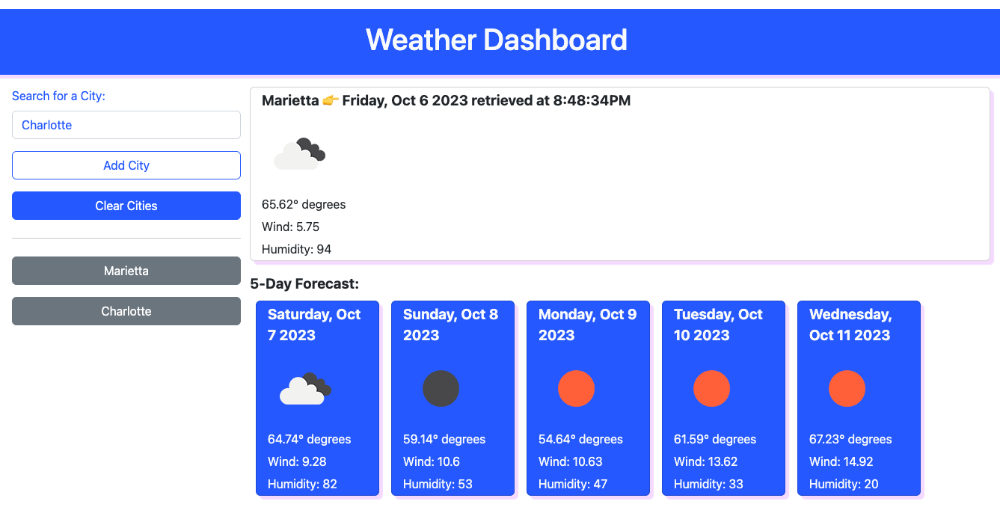
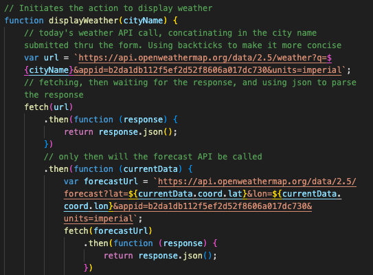
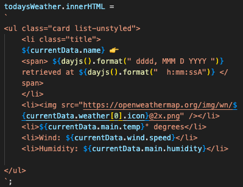
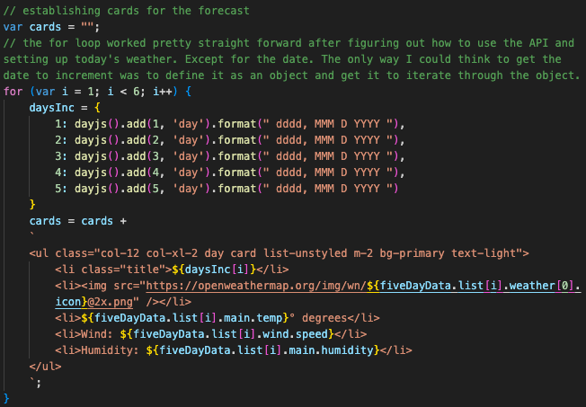
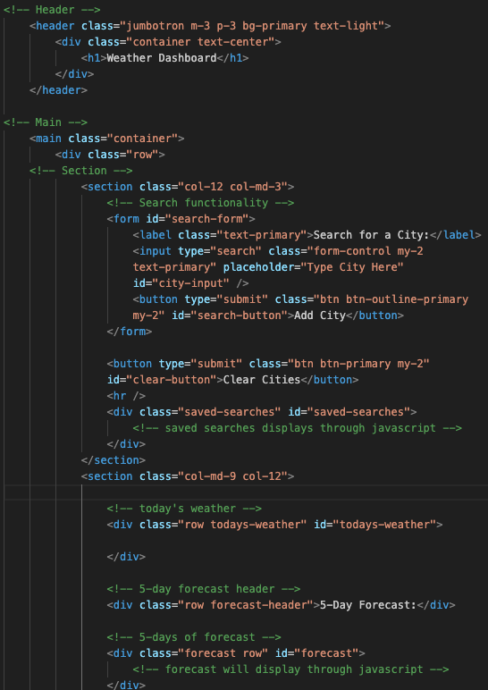

# WEATHER DASHBOARD 🌤️🌨️☀️⛈️🌈
### [View Project Here](https://twixmixyjanet.github.io/weather-dashboard/ "Weather Dashboard App") 

| Technology Used    | Resource URL |
| --------  | ------- |
| HTML      | https://developer.mozilla.org/en-US/docs/Web/HTML |
| CSS       | https://developer.mozilla.org/en-US/docs/Web/CSS |
| JavaScript | https://developer.mozilla.org/en-US/docs/Web/JavaScript |
| jQuery | https://jquery.com/ |
| DayJS | https://day.js.org/ |
| Bootstrap | https://getbootstrap.com/ |
| Git       | https://git-scm.com/ |
| GitHub     | https://github.com/ |
| VSCode    | https://code.visualstudio.com/ |

## Table of Contents

* [Description](#description)
* [Installation](#installation)
* [Usage](#usage)
* [Credits](#credits)
* [License](#license)

## Description:
This is a JavaScript, API and Bootstrap focused project with the goal to create a weather dashboard app. 
 
How to use this app:

* Place cursor in the text area to search for a city
* Click "Add City"
* Repeat steps 1 & 2 as needed
* Click the buttons of your favorite saved cities
* View weather data to make your plans accordingly

#### User Story
- AS A traveler
- I WANT to see the weather outlook for multiple cities
- SO THAT I can plan a trip accordingly

### Acceptance Criteria
- GIVEN a weather dashboard with form inputs
- WHEN I search for a city
- THEN I am presented with current and future conditions for that city and that city is added to the search history
- WHEN I view current weather conditions for that city
- THEN I am presented with the city name, the date, an icon representation of weather conditions, the temperature, the humidity, and the wind speed
- WHEN I view future weather conditions for that city
- THEN I am presented with a 5-day forecast that displays the date, an icon representation of weather conditions, the temperature, the wind speed, and the humidity
- WHEN I click on a city in the search history
- THEN I am again presented with current and future conditions for that city

### Lessons Learned

#### 1. APIs
[Today's Weather API](https://api.openweathermap.org/data/2.5/weather?q=marietta&appid=b2da1db112f5ef2d52f8606a017dc730) 
[Forecast Weather API](https://api.openweathermap.org/data/2.5/forecast?q=Marietta&appid=b2da1db112f5ef2d52f8606a017dc730) 
Figuring out the APIs was definitely my biggest hangup. I could not get the URL correct for the forecast because I was using something called onecall, that I thought I was supposed to use. Thankfully one of the AskBCS teachers helped me see why I was receiving the unauthorized error and pointed me in the direction of finding the forecast API URL.
 

#### 2. Displaying API data points
This of course leads into how to properly display the API data once I had it linked correctly. For this I placed the above URLs in my browser and looked through the properties until I could find the traversal method of displaying the data.
 

#### 3. Looping through dayjs
After I figured out my API issues and most of the data points needed for displaying, I then encountered the issue of how to increment the date to properly display for the forecast. I tried probably at least a dozen different ways before I landed on deciding to use an object to increment to additional days.
 

#### 4. Bootstrap
Since the last assignment contained all the boostrap code we needed, this project was a great opportunity for me to do some research and find the classes I wanted to apply for a decent layout for the app. I still used the custom style sheet for a couple properties I couldn't think how to apply, but I was very happy with the row and column properties here. Also the Jumbotron!!
 

#### Synopsis
Overall this was another great learning experience for me. It tested my knowledge from the last three weeks and also tested my patience in coming up with the solutions I needed. One of the biggest lessons I learned here was to reach out for help after struggling with an issue for anywhere over an hour. To make sure I have console logged everything I can think of and fix all the things I can fix, then reach out for help with the remaining aspects.

## Installation

1. Create a new repository on GitHub, to store this project.
2. Clone the repository to your computer.
3. Copy files to your own repository.
4. Make changes to the code.
5. Commit the changes to the local repo.
6. Push the changes to the remote repo.

## Usage

This is a weather dashboard app. If you would like to use this app follow the installation steps and curate it to your needs. If you would like to use this app to manage your weather related activities, follow the steps under the description above and click the link at the top of this page.

## License

MIT License
Copyright (c) 2023 Twixmixy / Janet Webster

## About The Author
### Janet Webster
Full Stack MERN Software Engineer in training.

- [GitHub](https://github.com/TwixmixyJanet/)
- [LinkedIn](https://www.linkedin.com/in/twixmixy/)
- [Twitter](https://twitter.com/Twixmixy)
- [WakaTime](https://wakatime.com/@Twixmixy)

